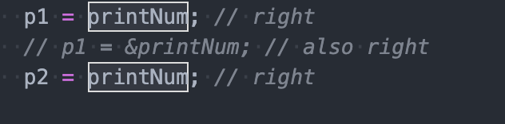

## vscode 选中词语高亮边框

vscode 的 one dark pro 有选中词语高亮边框的功能，如下：



假如想在其他主题也这样，比如 one light 主题，可以在 settings 设置如下

```json
"workbench.colorCustomizations": {
  "editor.selectionBackground": "#67769660",
  "editor.selectionHighlightBackground": "#ffffff10",
  "editor.selectionHighlightBorder": "#777575",
}
```